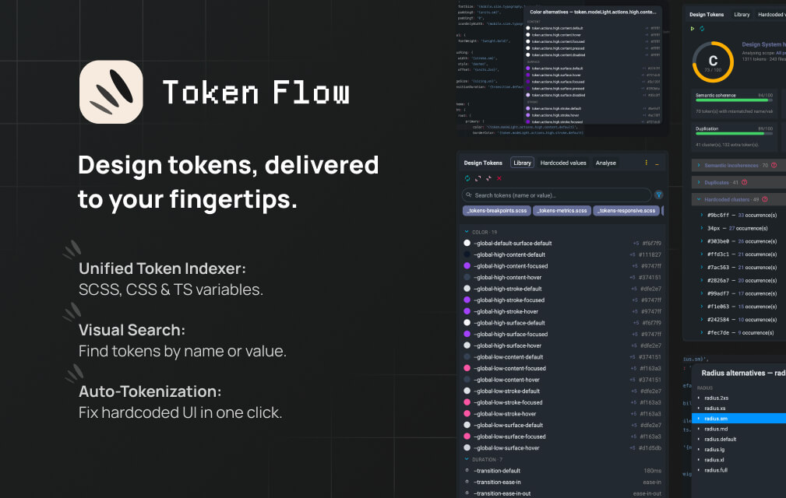

<div align="center">



# Token Flow

Find, insert, swap and audit design tokens (SCSS · CSS · TS/JS) from inside IntelliJ — without ever leaving your editor.

[](https://plugins.jetbrains.com/plugin/fr.fsh.tokendesigner](https://plugins.jetbrains.com/plugin/31635-token-flow))
[](LICENSE)
[](https://plugins.jetbrains.com/)

</div>

---

## Why?

Make using your tokens intuitive. Token Flow helps you find the right variable and keep your styles 
flawless without ever leaving your IntelliJ code.

Supported formats:

- SCSS variables (`$color-primary-500`)
- CSS Custom Properties (`--color-primary-500`)
- SCSS Maps (`("color-primary-500": #5d3fd3)`)
- TS/JS preset objects

## Highlights

- 🔎 **Library tool window** — searchable side panel with swatches, drag-and-drop, family/file filters.
- ⚡️ **Alternatives popup `(Alt+T)`** — pick a sibling token of the same category. Smart sort: HSL proximity for colours, ascending value for lengths.
- 🛟 **Hardcoded value inspection** — flags literals that already have a matching token, with one-click quick-fix. Aware of transparent wrappers (`utils.rem-calc(14px)`).
- 🧠 **Hover info** — popup showing resolved value & per-mode variants (light/dark/breakpoints) of the token under the caret.
- 📊 **Analyse tab** — full Design System health report: global score (A→F), semantic coherence, token-source usage, duplicates, unused tokens, hardcoded clusters. Every row links straight to the source.
- 🌳 **Scopes** — multi-UI projects (mobile / desktop / preset / common) supported via named scopes with their own root path and source files.

## Install

### From the JetBrains Marketplace

1. **Settings → Plugins → Marketplace**
2. Search for **Token Flow**
3. Install · Restart · enjoy.

### From a local build

Prerequisites: JDK 21.

```bash
./gradlew buildPlugin
# → build/distributions/token-flow-X.Y.Z.zip
```

Then in your IDE: **Settings → Plugins → ⚙️ → Install Plugin from Disk…** and pick the ZIP.

## Use cases

- **Migration** — refactor a hardcoded codebase to design tokens, file by file.
- **Multi-brand audit** — keep a multi-brand or light/dark Design System aligned and free of dead tokens.
- **Theme debugging** — see how a token resolves in Dark vs Light mode via the hover popup.
- **Preset iteration** — work on a PrimeUIX / Style-Dictionary preset with instant feedback.

## Stack

- Kotlin 1.9 + IntelliJ Platform Gradle Plugin 2.x
- Target: IntelliJ IDEA Community 2024.2+ (forward-compatible)
- Pure-text parsing (no PSI dependency) → works in Community editions

## Project layout

```
src/main/kotlin/fr/fsh/tokendesigner/
├── model/          DesignToken, TokenCategory, TokenKind
├── scanner/        TokenScanner, TokenCategorizer, TokenIndex
├── completion/     code-completion contributor
├── inspection/     hardcoded-value inspection + quick-fix
├── analyze/        DesignSystemAnalyzer + AnalysisReport
├── settings/       per-project Settings UI (Scopes, triggers)
├── hover/          hover-info popup wiring
├── actions/        IDE actions (menus, shortcuts)
└── ui/             tool window, panels, renderers, charts
```

## Roadmap & changelog

- 📍 [`ROADMAP.md`](ROADMAP.md) — phases, what's done, what's next
- 📋 [`FEATURES.md`](FEATURES.md) — feature matrix
- 📝 Plugin changelog — see the **Versions** tab on the Marketplace listing

## Contributing

Bug reports, feature requests, and PRs are welcome. Open an issue first for non-trivial changes so we can align on direction.

## License

[MIT](LICENSE) · © Robin Lopez

## About

Built by **Robin Lopez** — designer & front-end engineer.

[robinlopez.fr](https://www.robinlopez.fr/) · [LinkedIn](https://www.linkedin.com/in/robin-lopez-designer/) · [Bluesky](https://bsky.app/profile/lopezrobin.bsky.social) · [Bento](https://robinlopez.github.io/robinlopezbento/)

If Token Flow saves you time, you can support its development:

<a href="https://www.buymeacoffee.com/robinlopez">
  
</a>
